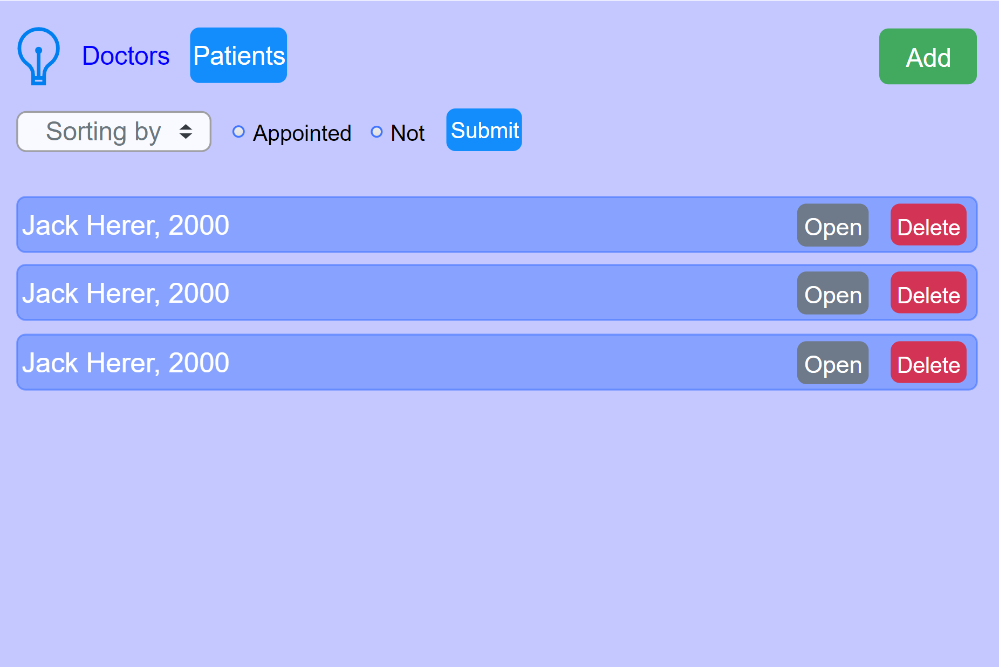
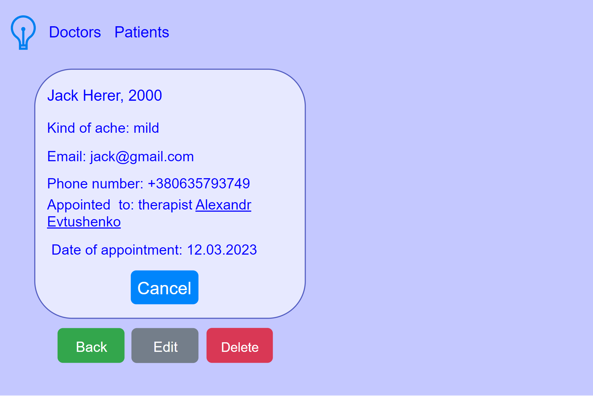
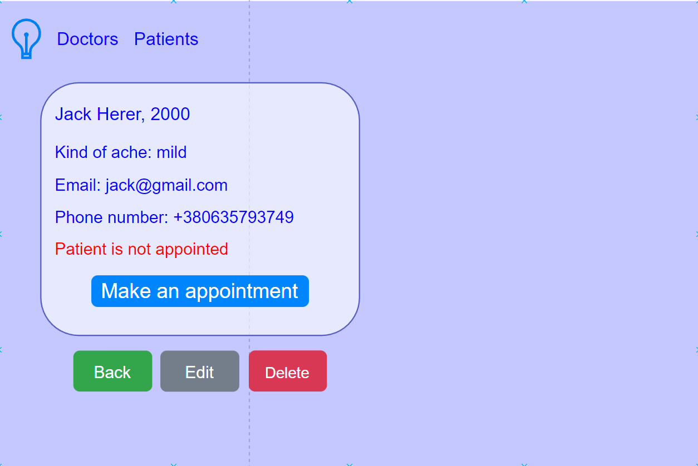
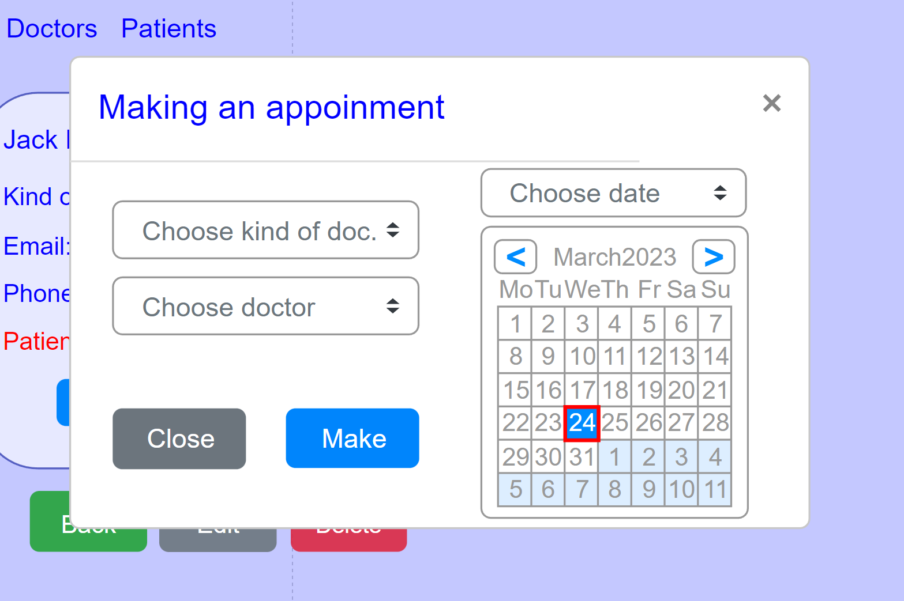
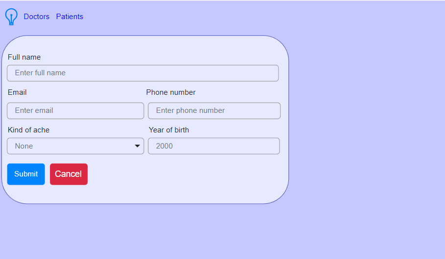
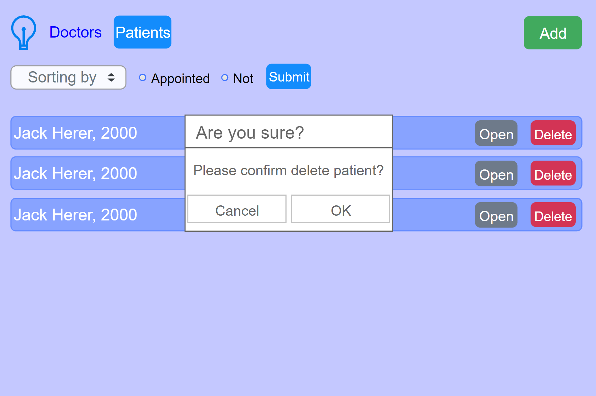

# 
**Dentist clinic**

## **Vision**
"Dentist clinic" is a web-application which allows administrator of a clinic to make an appointment to doctor for a patient.

Application should provide:  
* Display list of patients;
* Display information about patient (fields: full name, year of birth, kind of ache (none, mild, middle, strong), phone number, email);
* Enable to create, read, update, delete patient;
* Enable to make an appointment to a doctor;
* If patient has an appointment, show doctor's specialty, full name and time of the appointment;
* Display list of doctors;
* Display information about doctor (fields: full name, seniority, specialty (therapist, orthopedist, surgeon, radiologist), amount of assigned pacients, phone number, email);
* Enable to create, read, update, delete doctor;
* Sorting list of appointments of patients by appointment time or by kind of ache (from hard to mild);
* Sorting doctors by their workload;
* Filtering doctors by their specialty;

## **1. Patients**

### **1.1 Display list of patients**
The mode is designed to view the list of patients. Enable to filter patients whom has an appointment and whom doesn't. Also, if it's possible to display sorting list of patients by their full name, kind of ache or year of birth.  

***Main scenario***
* Administrator selects item "Patient";
* Application displays list of Patients;

  
Pic. 1.1 View the Patients list  

The list displays patient's full name and year of birth.

***Sorting and filtering:***
* Administrator selects kind of sorting (by kind of ache, by full name or by year of birth);
* Selects, he needs list of appointed patients or don't (default both);
* Press button "submit";
* Application shows filtered and sorted list of patients.

### **1.2 Display info about patient**
The mode is designed to view information about patient. Enable to make or cancel an appointment, edit information about patient or delete him.  

***Main scenario***
* Administrator clicks button "Open" on the page with list of patients on in the selected patient line;
* Application opens page with information about selected patient;
* If administrator click on doctor, application change page to page with information about this doctor.  

***Cancel scenario:***
* Administrator clicks button "Cancel";
* Application cancel appointment, remove information about it and add button to make an appointment.

***Back scenario:***
* Administrator clicks button "Back" on the page with information about patient;
* Application opens page with patients list.

  
Pic. 1.2 Page with info about appointed patient

  
Pic. 1.3 Page with info about isn't appointed patient

Page displays information about patient: 
* Full name - unique full name(first name and last name) of patient; 
* Year - year of patient's birth;
* Kind fo ache - how hard is patient's ache;
* Email - unique patient's email;
* Phone number - unique patient's phone number;
* If the patient is appointed, show doctor and date of appointment.  

### **1.3 Making appointment**
The mode is designed to making an appointment of person.

***Main scenario***
* Administrator clicks button "Make an appointment";
* Application opens the modal window for making an appointment;
* Administrator selects kind of doctor specialty, date of appointment and then chooses doctor (application shows doctors who have less than 7 clients in chosen day and sorting doctors by amount of clients in this day);
* After pressing button "Make", application creates an appointment to chosen doctor;

***Close scenario:***
* Administrator clicks button "Close";
* Application close modal window, opens page with info about patient without making an appointment.

  
Pic. 1.4 Modal window for making an appointment

### **1.4 Edit patient**
The mode is designed to edit patient's personal information.

***Main scenario***
* Administrator clicks button "Edit" on the page with patient's information;
* Application opens page for editing;
* Administrator changes information and presses “Save” button;
* If any data is entered incorrectly, incorrect data messages are displayed;
* If entered data is valid, then record is adding to database;
* If error occurs, then error message is displaying;
* If changed patient's information is successfully added, then page with information of person is displaying.

***Cancel scenario:***
* Administrator clicks the “Edit” button in the patient information view mode;
* Application opens page for editing;
* Administrator presses “Cancel” button;
* Entered data don’t save in Data Base, then page with edit information of person is displaying.  

Pic. 1.5 Edit page  

When editing a patient's information, the following details are entered:
* Full name – patient’s first and last name;
* Email - patient's email;
* Phone number - patient's phone number;
* Kind of ache – how hard is patient's ache;
* Year of birth - patient's year of birth.

Constraints for data validation:
* Full name – maximum length of 90 characters, format First name Last name;
* Email - email standards;
* Phone number - begins on +380 and has 13 symbols;
* Year of birth - not less than 1930.

### **1.5 Add new patient**
The mode is designed to add new patient.

***Main scenario***
* Administrator clicks button "Add" on the page with list of patients;
* Application opens page for enter new patient's information;
* Administrator enters information and presses “Save” button;
* If any data is entered incorrectly, incorrect data messages are displayed;
* If entered data is valid, then record is adding to database;
* If error occurs, then error message is displaying;
* If new patient record is successfully added, then page with information of new patient is displaying.

***Cancel scenario:***
* Administrator clicks the “Add” button in the patient information view mode;
* Application opens page for creating new patient;
* Administrator presses “Cancel” button;
* Entered data don’t save in Data Base, then page with list of patients is displaying.    

Pic. 1.6 Creating new patient page

When editing a patient's information, the following details are entered:
* Full name – patient’s first and last name;
* Email - patient's email;
* Phone number - patient's phone number;
* Kind of ache – how hard is patient's ache;
* Year of birth - patient's year of birth.

Constraints for data validation:
* Full name – maximum length of 90 characters, format First name Last name;
* Email - email standards;
* Phone number - begins on +380 and has 13 symbols;
* Year of birth - not less than 1930.

### **1.5 Add new patient**
The mode is designed to delete a selected patient.

***Main scenario:***
* Administrator presses the "Delete" button in the selected order line on the page with list of patients or on the page with information about definite patient;
* If the patient can be removed, a confirmation dialog window is displayed;
* Administrator confirms the deleting of the patient;
* Record is deleted from database;
* If error occurs, then error message displays;
* If patient record is successfully deleted, then list of patients without deleted records is displaying.

***Cancel operation scenario:***
* Administrator presses the "Delete" button;
* Application displays confirmation dialog window “Please confirm delete patient?”;
* User press “Cancel” button;
* List of patients without changes is displaying. 

Pic. 1.7 Deleting patient dialog window